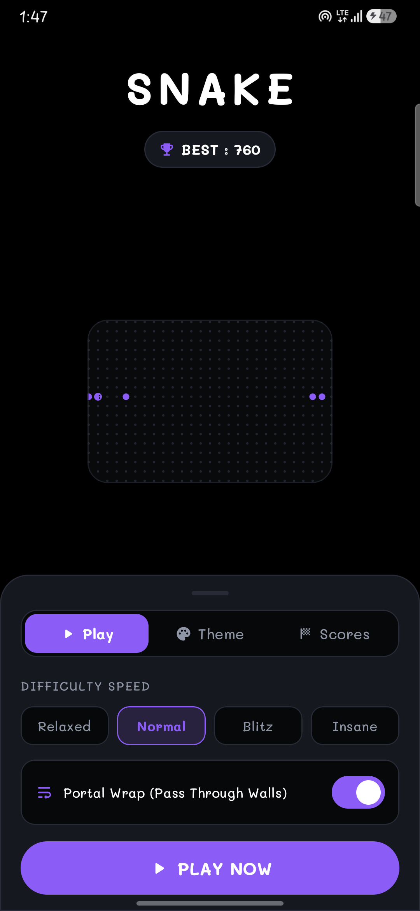
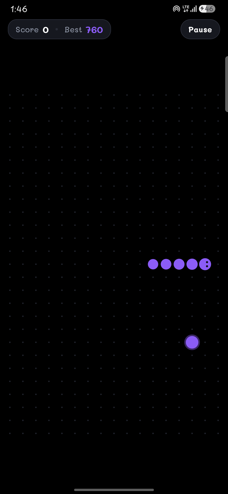
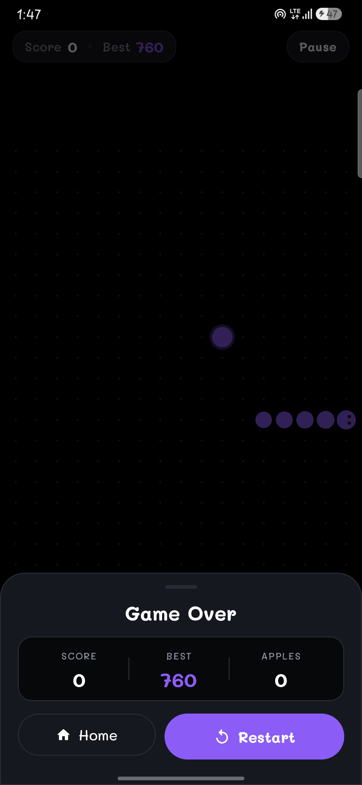
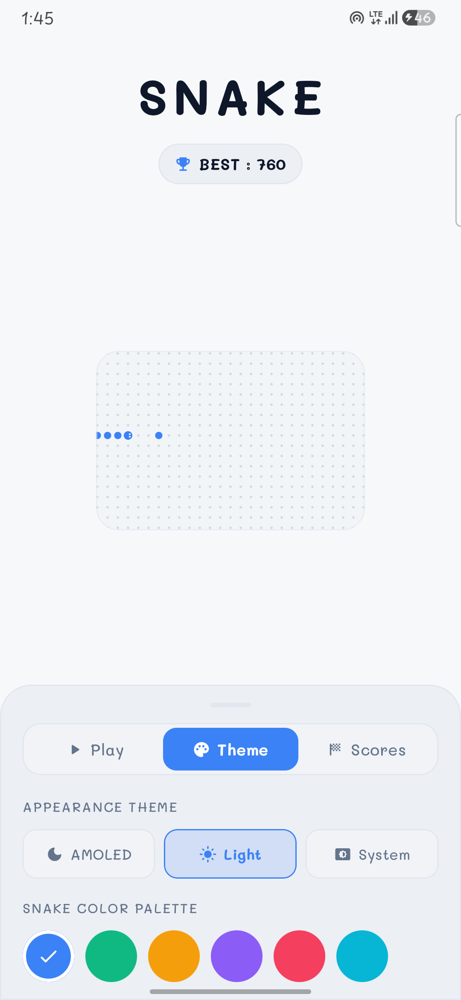
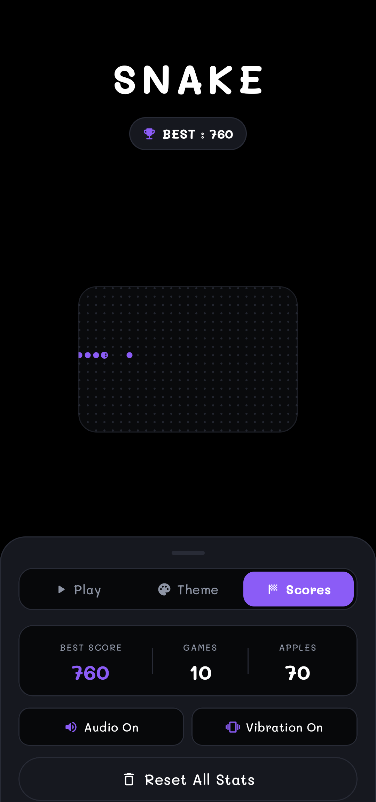
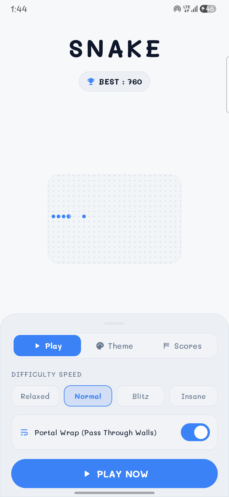

# 🐍 Minimal Snake Game (Android Jetpack Compose)

<p align="center">
  <a href="https://github.com/apandey-dev/snake-game-compose/releases/latest">
    
  </a>
  <a href="https://github.com/apandey-dev/snake-game-compose/releases">
    
  </a>
  
  
</p>

A modern, ultra-minimalist Snake game designed for Android using **Kotlin** and **Jetpack Compose**. Featuring pure swipe gesture controls, AMOLED pitch black and clean day themes, Mali typography, R8 security obfuscation, and custom zero-waste bottom sheets.

---

## 📥 Direct APK Download

Download the signed, secure, and ultra-compressed **Universal Release APK** directly:
- 📦 **[Snake-v1.0.0-Universal-Release.apk (1.94 MB)](https://github.com/apandey-dev/snake-game-compose/releases/download/v1.0.0/Snake-v1.0.0-Universal-Release.apk)**
- **Compatibility**: Android 7.0 (Nougat / API 24) and above up to Android 15+.
- **Security**: Full R8 code obfuscation & resource shrinking (anti-reverse engineering).

---

## 📱 Screenshots Showcase

<div align="center">
  <table>
    <tr>
      <td align="center" width="33%">
        <b>AMOLED Home</b><br><br>
        
      </td>
      <td align="center" width="33%">
        <b>Live Gameplay</b><br><br>
        
      </td>
      <td align="center" width="33%">
        <b>Game Over Sheet</b><br><br>
        
      </td>
    </tr>
    <tr>
      <td align="center" width="33%">
        <b>Theme & Skin Picker</b><br><br>
        
      </td>
      <td align="center" width="33%">
        <b>Scores & Stats</b><br><br>
        
      </td>
      <td align="center" width="33%">
        <b>Day Light Mode</b><br><br>
        
      </td>
    </tr>
  </table>
</div>

---

## ✨ Features

- 🎮 **Pure Swipe Gestures**: Smooth, intuitive 4-direction swipe controls anywhere on screen with zero latency and an intelligent 2-turn move buffer (prevents accidental 180° self-collisions).
- 🌌 **True AMOLED Dark & Clean Day Themes**:
  - **AMOLED Night**: Pure `#000000` pitch black canvas with faint glowing matrix dots.
  - **Day Light**: Minimalist `#F7F8FA` clean aesthetic.
  - **Snake Skin Swatches**: 6 vibrant customizable skins (Electric Blue, Neon Emerald, Sunset Amber, Cyber Violet, Coral Rose, Matrix Cyan).
- 🎨 **Minimal Dot Matrix Canvas**:
  - Dotted grid matching modern minimal design aesthetics.
  - Circular snake segments with **directional eyes** looking towards the current movement direction.
  - Pulsing animated food with bonus golden apples.
- 📑 **Custom Zero-Waste Bottom Sheets**:
  - **Play Tab**: Difficulty speeds (`Relaxed`, `Normal`, `Blitz`, `Insane`) & `Portal Wrap` mode toggle.
  - **Theme Tab**: Seamless theme switching and snake palette selector.
  - **Score Tab**: High scores, apples eaten, games count, haptics & audio toggles.
  - **Game Over & Pause**: Sleek slide-up sheets with restart and menu actions.
- 🔤 **Custom Mali Typography**: Consistent typography using the **Mali** font family across the entire app.
- ⚡ **Zero-Latency Audio & Haptics**: Synthesized retro audio and tactile vibration feedback on turns, apples eaten, and game over.
- 💾 **Persistent Data**: High score, total stats, and user preferences stored with **Jetpack DataStore**.

---

## 🛠️ Tech Stack & Architecture

- **Language**: Kotlin 2.0
- **UI Framework**: Jetpack Compose (Material 3)
- **Architecture**: MVVM + Unidirectional Data Flow (UDF)
- **State Management**: Kotlin Coroutines & `StateFlow`
- **Persistence**: Jetpack DataStore Preferences
- **Rendering**: Hardware-accelerated Jetpack Compose Canvas
- **Minimum SDK**: Android API 24 (Android 7.0+)
- **Target SDK**: Android API 34 (Android 14)

---

## 📂 Project Structure

```
Snake Game/
├── app/
│   ├── src/main/
│   │   ├── java/com/minimal/snake/
│   │   │   ├── MainActivity.kt                 # Edge-to-edge entrypoint
│   │   │   ├── data/
│   │   │   │   ├── Models.kt                   # Enums, Skins, Settings & Stats
│   │   │   │   └── GamePreferences.kt          # DataStore preferences wrapper
│   │   │   ├── game/
│   │   │   │   ├── GameEngine.kt               # Game loop, gesture buffer & collision
│   │   │   │   ├── GameState.kt                # Immutable game state
│   │   │   │   └── SoundManager.kt             # Audio synthesizer & haptics
│   │   │   └── ui/
│   │   │       ├── components/
│   │   │       │   ├── CustomDialogs.kt        # GameOver, Pause & Reset bottom sheets
│   │   │       │   ├── GameBoardCanvas.kt      # Dotted matrix canvas & swipe detector
│   │   │       │   ├── HomeBottomSheet.kt      # Play, Theme & Score segmented sheet
│   │   │       │   ├── MinimalButton.kt        # Tactile pill & outline buttons
│   │   │       │   └── TopBar.kt               # Single-row score & text pause button
│   │   │       ├── screens/
│   │   │       │   ├── HomeScreen.kt           # Minimal home & animated matrix
│   │   │       │   └── GameScreen.kt           # Game screen & canvas container
│   │   │       ├── theme/
│   │   │       │   ├── Color.kt                # AMOLED & Light palettes
│   │   │       │   ├── Theme.kt                # Dynamic Theme provider
│   │   │       │   └── Type.kt                 # Mali font typography configuration
│   │   │       └── viewmodel/
│   │   │           └── SnakeViewModel.kt       # ViewModel bridging engine & UI
│   │   └── res/
│   │       ├── font/                           # Mali TTF font resources
│   │       └── values/                         # Strings, colors & themes
├── screenshots/                                # High-resolution device screenshots
├── build.gradle.kts
└── settings.gradle.kts
```

---

## 🚀 Getting Started

### Prerequisites
- Android Studio Hedgehog / Iguana / Jellyfish or newer
- JDK 17
- Android SDK (API 34)

### Installation & Run

1. Clone the repository:
   ```bash
   git clone https://github.com/<your-username>/snake-game-compose.git
   cd snake-game-compose
   ```

2. Open the project in Android Studio or build via terminal:
   ```bash
   ./gradlew assembleDebug
   ```

3. Install on connected device:
   ```bash
   adb install -r app/build/outputs/apk/debug/app-debug.apk
   ```

---

## 📄 License
This project is open source and available under the [MIT License](LICENSE).
The **Mali** typeface is licensed under the [SIL Open Font License (OFL)](Mali/OFL.txt).
